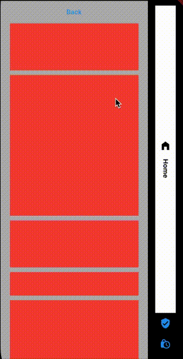
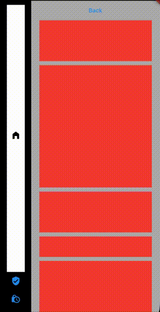
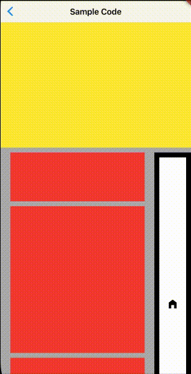

# scroll-to-index

This package provides a way to have a side navbar with some personalisation with Flutter.

<table>
  <thead>
    <tr>
        <th>Basic usage</th>
        <th>Reversed usage</th>
        <th>Inside another scroll</th>
    </tr>
  </thead>
  <tbody>
    <tr>
        <td>
            
        </td>
        <td>
            
        </td>
        <td>
            
        </td>
    </tr>
  </tbody>
</table>

## Getting Started

In the `pubspec.yaml` of your flutter project, add the following dependency:

```yaml
dependencies:
  ...
  flutter_side_navbar: any
```

In your library add the following import:

```dart
import 'package:flutter_side_navbar/flutter_side_navbar.dart';
```

For help getting started with Flutter, view the online [documentation](https://flutter.io/).

## Usage

First, add `SideNavbar` in your `Scaffold`:

```dart
class MyApp extends StatelessWidget {
  @override
  Widget build(BuildContext context) {
    return SafeArea(
      child: Scaffold(
        backgroundColor: Colors.white70,
        body: SideNavbar(
          pages: [],
        ),
      ),
    );
  }
}
```

Then, add your different `pages` as a list of `Widget`:

```dart
class Basic extends StatelessWidget {
  @override
  Widget build(BuildContext context) {
    return SafeArea(
      child: Scaffold(
        backgroundColor: Colors.white70,
        body: SideNavbar(
          pages: [
            SideItemModel(
              defaultIconColor: Colors.blue,
              onTap: () {},
              page: Column(
                children: [
                  Container(
                    height: 800,
                    width: double.infinity,
                    color: Colors.green,
                  ),
                ],
              ),
              icon: Icons.home_filled,
            ),
            SideItemModel(
              defaultIconColor: Colors.blue,
              onTap: () {},
              page: Column(
                children: [
                  Container(
                    height: 1000,
                    width: double.infinity,
                    color: Colors.red,
                  ),
                ],
              ),
              icon: Icons.verified_user,
            ),
          ],
        ),
      ),
    );
  }
}
```

You're now ready to go !

## Customize

### SideItemModel

```dart
  /// Widget to show
  final Widget? page;

  /// Icon showed according to the page in the navigation
  final IconData icon;

  /// Used as a complement of the icon
  final String? iconTitle;

  /// Used for specific development when the user click on the icon in the navigation
  final Function()? onTap;

  /// Used for specific development when the widget is the most visible
  final Function()? onMostVisible;

  /// Used for specific development when the widget lost focus
  final Function()? lostFocus;

  /// Default color of the icon when the page is not the most visible
  final Color defaultIconColor;

  /// Background color of the navigation item when the corresponding page is focused
  final Color focusBackgroundColor;

  /// Icon color of the navigation item when the corresponding page is focused
  final Color focusIconColor;

  /// Text color of the navigation item when the corresponding page is focused
  final Color focusTextColor;
```

### SideNavbar
```dart
  /// List of all the pages to show
  final List<SideItemModel> pages;

  /// Widget of navigationWidth
  final double navigationWidth;

  /// Navigation background color
  final Color navigationBackgroundColor;

  /// Used to personalised the container of the navigation buttons
  final BoxDecoration decorationItem;

  /// Used to change the position of the navigation
  ///
  /// reversed = false ==> Navigation on the right
  /// reversed = true ==> Navigation on the left
  final bool reversed;

  /// Used to specify to the package if an AppBar is shown
  final bool appBarIsShown;

  /// Used to set the padding for the page
  final EdgeInsets? padding;

  /// Used to set the padding of the navigation
  final EdgeInsets? paddingNavigation;

  /// If the scroll view does not shrink wrap, then the scroll view will expand to the maximum allowed size
  final bool shrinkWrap;

  /// Used to set the scroll controller of the package for specific development
  final AutoScrollController? controller;

  /// Used to set the scroll physics of the package
  final ScrollPhysics? physics;

  /// Used to set the duration of the animation when a user tap on a navigation item's and the scroll is moving
  final Duration duration;
```
